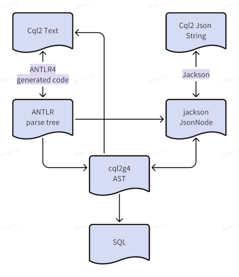

# cql2g4
cql2g4 is a parer for CQL2(Common Query Language) using ANTLR4

https://www.ogc.org/standards/cql2/

https://docs.ogc.org/is/21-065r2/21-065r2.html

# Examples
```java
import io.github.IndoorSpatial.cql2.Cql2G4;

import com.fasterxml.jackson.core.JsonProcessingException;

public class Main {
    static void main(String[] args) throws JsonProcessingException {
        String cqlText = "speed > 3 AND S_CONTAINS(POLYGON ((0 0, 1 0, 1 1, 0 1, 0 0)), location)";
        System.out.println("origin cql text: " + cqlText);

        Cql2G4 cql2G4 = new Cql2G4();
        AstNode astNode = cql2G4.textToAst(cqlText);
        System.out.println("convert to ast:\n" + astNode.ToString());
        /*
            "and" (AndOrExpression)
                ">" (BinaryComparisonPredicate)
                    "speed" (PropertyLiteral)
                    "3" (IntegerLiteral)
                "s_contains" (SpatialPredicate)
                    "POLYGON ((0 0, 1 0, 1 1, 0 1, 0 0))" (GeometryLiteral)
                    "location" (PropertyLiteral)
         */
        System.out.println("convert to json: " + cql2G4.astToJsonString(astNode));
        /*
            {
              "op" : "and",
              "args" : [ {
                "op" : ">",
                "args" : [ {
                  "property" : "speed"
                }, 3 ]
              }, {
                "op" : "s_contains",
                "args" : [ {
                  "type" : "Polygon",
                  "coordinates" : [ [ [ 0.0, 0.0 ], [ 1, 0.0 ], [ 1, 1 ], [ 0.0, 1 ], [ 0.0, 0.0 ] ] ]
                }, {
                  "property" : "location"
                } ]
              } ]
            }
        */
        System.out.println("convert to sql: " + cql2G4.astToSql(astNode));
        /*
          "speed" > 3 AND ST_CONTAINS(ST_GeomFromText('POLYGON ((0 0, 1 0, 1 1, 0 1, 0 0))'), "location")
        */
    }
}
```

# Expression format
There are 6 related expression formats in cql2g4.



## Text
This is text format defined in the cql2 standard
```text
balance-150.0 > 0
```

## Json string and in-memory JsonNode
This is json format defined in the cql2 standard
```json
{
  "op": ">",
  "args": [
    {
      "op": "-",
      "args": [
        { "property": "balance" },
        150.0
      ]
    },
    0
  ]
}
```
It will be parsed by jackson to obtain JsonNodes in memory.

## Parse tree
The ANTLR4 generated code will parse the text format of expression into parse tree which looks like:


## AST (Abstract Syntax Tree)
Both text and json format will be converted to AST.
```json
{
  "op" : ">",
  "type" : "BinaryComparisonPredicate",
  "args" : [ {
    "op" : "-",
    "type" : "ArithmeticExpression",
    "args" : [ {
      "type" : "PropertyLiteral",
      "value" : "balance"
    }, {
      "type" : "DoubleLiteral",
      "value" : 150.0
    } ]
  }, {
    "type" : "IntegerLiteral",
    "value" : 0
  } ]
}
```
It looks like json format but contains extra type information for example "ArithmeticExpression", "PropertyLiteral".
The type information may help converters to do the conversion recursively.
We also provide a ToString(not toString) function in AstNode to convert AST tree into simple text format:
```test
">" (BinaryComparisonPredicate)
    "-" (ArithmeticExpression)
        "balance" (PropertyLiteral)
        "150.0" (DoubleLiteral)
    "0" (IntegerLiteral)
```

## SQL
```sql
-- SELECT * FROM t WHERE
"balance" - 150.0 > 0;
```
The SqlConverter will generate the where clause according to AST format, without the "SELECT" part and the word "WHERE".


# SQL

## Dialect
The only currently supported SQL dialect is PostgreSQL, as it offers excellent support for intervals, arrays, and spatial data simultaneously.
We will support other mainstream SQL dialects in the future.

## Examples
| CQL2                                                                                             | SQL WHERE clause (PostgreSQL dialect)                                                                                                             |
|--------------------------------------------------------------------------------------------------|---------------------------------------------------------------------------------------------------------------------------------------------------|
| wind_speed > 2 * 3 + 4                                                                           | "wind_speed" > 2 * 3 + 4                                                                                                                          |
| city='Shenzhen'                                                                                  | "city" = 'Shenzhen'                                                                                                                               |
| value=field^2                                                                                    | "value" = POWER("field", 2)                                                                                                                       |
| value IN (1.0, 2.0, 3.0)                                                                         | "value" IN (1.0, 2.0, 3.0)                                                                                                                        |
| owner NOT LIKE '%Mike%'                                                                          | NOT ("owner" LIKE '%Mike%')                                                                                                                       |
| value IS NULL OR value BETWEEN 10 AND 20                                                         | "value" IS NULL OR "value" BETWEEN 10 AND 20                                                                                                      |
| A_CONTAINS(layer:ids, ('layers-ca','layers-us'))                                                 | "layer:ids" @> ARRAY ['layers-ca', 'layers-us']                                                                                                   |
| S_INTERSECTS(geom,POINT(36.3 32.2))                                                              | ST_INTERSECTS("geom", ST_GeomFromText('POINT (36.3 32.2)')) --(extension postgis needed)                                                          |
| S_WITHIN(location,BBOX(-118,33.8,-117.9,34))                                                     | ST_WITHIN("location", ST_GeomFromText('POLYGON((-118.0 33.8, -117.9 33.8, -117.9 34.0, -118.0 34.0, -118.0 33.8))')) --(extension postgis needed) |
| T_DURING(INTERVAL(starts_at, ends_at), INTERVAL('1990-08-09T23:30:00Z', '2025-10-29T17:39:00Z')) | TSRANGE("starts_at", "ends_at", '[]') <@ TSRANGE('1990-08-09T23:30:00Z', '2025-10-29T17:39:00Z', '[]')                                            |
| T_BEFORE(built, DATE('2015-01-01'))                                                              | TSRANGE("built", "built", '[]') << TSRANGE(DATE '2015-01-01', DATE '2015-01-01', '[]')                                                            |
| ACCENTI(etat_vol) = ACCENTI('débárquér')                                                         | UNACCENT("etat_vol") = UNACCENT('débárquér') --(extension unaccent needed)                                                                        |
| CASEI(road_class) IN (CASEI('Οδος'),CASEI('Straße'))                                             | LOWER(road_class) IN (LOWER('Οδος'),LOWER('Straße'))                                                                                              |
| my_function(windSpeed) < 4                                                                       | my_function("windSpeed") < 4 --(user defined function needed)                                                                                     |


# Dependencies

* antlr4:4.13.2
* jackson-core:2.19.1
* jackson-databind:2.19.1
* jts-core:1.19.0
* jts-io-common:1.19.0
